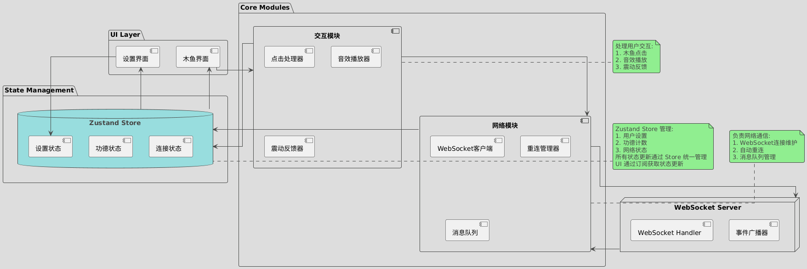
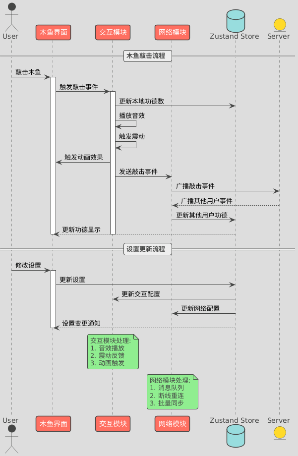

# 联机电子木鱼产品报告

## 1. 项目概述

这是一款基于 React Native 和 Expo 开发的跨平台电子木鱼应用。通过实时网络连接，支持多人同时在线修行，让修行不再孤单。

后端采用轻量级的 Hono.js 框架，基于 Node.js 构建，提供 WebSocket 服务支持多人实时互动。

### 1.0 产品功能介绍

#### 多人联机修行

- 多个用户可以同时敲击同一个电子木鱼
- 实时同步显示所有用户的功德
- 采用 WebSocket 技术实现毫秒级同步

#### 敲击反馈系统
- **视觉反馈**
  - 流畅的木鱼敲击动画效果
  - 动态功德数值浮动显示（+1, +2 等）
  - 连击时功德数值渐进放大
  - 其他用户功德以半透明形式显示

- **听觉反馈**
  - “高品质”木鱼敲击音效
  - 动态音量反馈
  - 可通过设置开关音效

- **触觉反馈**
  - 移动设备震动反馈
  - 敲击节奏同步
  - 可通过设置调整震动强度

#### 连击系统
- 连续敲击触发特殊动画效果
- 连击等级与显示效果：
  - 单次敲击：+1（标准大小）
  - 2-4 连击：+2（1.2倍放大）
  - 5-9 连击：+5（1.5倍放大）
  - 10次以上：+10（2倍放大）

### 1.1 技术栈

#### 前端
- 框架: React Native + Expo
- UI组件: Gluestack UI
- 样式: NativeWind (Tailwind CSS)
- 状态管理: Zustand
- 网络通信: WebSocket
- 动画: React Native Reanimated
- 路由: Expo Router
- 音效: Expo AV
- 触感反馈: Expo Haptics

#### 后端
- 运行环境: Node.js
- Web 框架: Hono.js
- WebSocket: ws

### 1.2 主要功能

- 木鱼敲击与功德计数
- 实时多人同步修行
- 敲击音效与震动反馈
- 功德数浮动动画
- 深色/浅色主题切换


## 2. 架构设计

### 2.1 目录结构 

```
├── app/                    # 应用程序主要代码
│   ├── index.tsx          # 木鱼主页面
│   ├── settings.tsx       # 修行设置页面
│   └── _layout.tsx        # 布局组件
├── components/            # UI组件
│   └── ui/               # 基础UI组件
├── hooks/                # 自定义Hooks
│   ├── useSound.ts      # 木鱼音效Hook
│   ├── useSettings.ts   # 设置管理Hook
│   └── useWebSocket.ts  # 联机同步Hook
└── assets/              # 静态资源
     ├── sound.mp3        # 木鱼音效
     └── images/          # 图片资源
```

### 2.2 应用架构图



### 2.3 时序图



### 2.4 核心模块

1. **点击计数模块**
- 本地点击计数
- 点击动画效果
- 声音和震动反馈

2. **WebSocket通信模块**
- 实时数据同步
- 断线重连机制
- 错误处理

3. **设置模块**
- 主题设置
- 声音设置
- 震动设置
- 服务器配置

4. **UI组件系统**
- 基于Gluestack UI
- 支持深色/浅色主题
- 响应式设计

## 3. 关键实现细节

### 3.1 点击处理机制

- 使用防抖处理连续点击
- 批量处理和发送点击事件

### 3.2 实时同步机制

- 基于 WebSocket 的可靠长连接
- 智能重连机制（最多5次重试）
- 实时的连接状态反馈
- 离线状态自动处理
- 基于时间戳的事件排序，精确还原他人修行节奏
- 高效的事件批处理机制


### 3.3 动画系统

- 使用React Native Reanimated
- 实现缩放、旋转动画
- 浮动文字动画效果
- 平滑的过渡效果

### 3.4 主题系统

- 支持深色/浅色主题
- 响应系统主题变化
- 自定义主题颜色配置
- 主题切换动画

## 4. 性能优化

- 使用React.memo优化组件重渲染
- WebSocket消息批处理
- 动画性能优化
- 资源懒加载


## 5. 后续优化方向

1. 添加用户认证系统
2. 实现消息幂等传输
3. 添加更多交互动画
4. 添加统计和分析功能
5. 实现多语言支持
